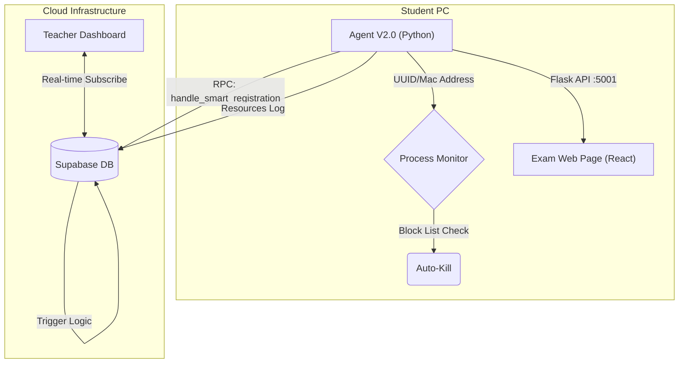

# FACE-EXAM: Intelligent Exam Proctoring System
### ระบบคุมสอบอัจฉริยะด้วย AI และ Smart Agent (V2.0)

**FACE-EXAM** คือแพลตฟอร์มคุมสอบออนไลน์แบบครบวงจร (End-to-End Proctoring Solution) ที่ผสานการทำงานระหว่าง **Web Dashboard (React)** และ **Smart Client Agent (Python)** เพื่อความปลอดภัยสูงสุดในการสอบ ลดภาระผู้คุมสอบด้วยระบบอัตโนมัติ และป้องกันการทุจริตแบบ Real-time โดยเวอร์ชันล่าสุด (V2.0) ได้อัพเกรดสถาปัตยกรรมให้รองรับการทำงานแบบ **Autonomous & Self-Healing**

---

## 🚀 ฟีเจอร์ใหม่ในเวอร์ชัน 2.0 (New in V2.0)

### 🤖 1. Smart Agent Architecture
ระบบ Client Agent รุ่นใหม่ถูกออกแบบใหม่ทั้งหมดเพื่อให้ทนทานต่อสภาวะเครือข่ายที่ไม่เสถียร
- **Auto-Discovery & Restoration**: Agent ตรวจจับ **Machine ID (UUID)** และ **Mac Address** เพื่อ "จดจำ" ที่นั่งสอบ หากเครื่องรีสตาร์ทหรือเน็ตหลุด Agent จะกลับมา Login ที่นั่งเดิมอัตโนมัติ (Smart Session Recovery) โดยไม่ต้องให้นักศึกษาลงทะเบียนใหม่
- **Background Mode**: ทำงานแบบ Background Process ซ่อนหน้าต่าง Console ไม่รบกวนสายตานักศึกษา และป้องกันการปิดโปรแกรมโดยไม่ตั้งใจ
- **Direct RPC Integration**: สื่อสารผ่าน **Supabase RPC (`handle_smart_registration`)** โดยตรง ลดความซับซ้อนของการ Config และเพิ่มความปลอดภัยของข้อมูล

### 🛡️ 2. Enhanced Security & Failover
- **State Preservation**: Logic การจองที่นั่งถูกย้ายไปทำงานบน Database Server (ผ่าน Trigger) ทำให้ข้อมูลสถานะ (Online/Offline) แม่นยำแม้ Agent จะขาดการติดต่อไปชั่วขณะ
- **Heartbeat V2**: ปรับปรุงระบบตรวจสอบการเชื่อมต่อ ลด False Alarm ด้วยการตรวจสอบย้อนหลัง 60 วินาที

---

## 🎯 ฟีเจอร์หลัก (Core Features)

### 👨‍🏫 สำหรับอาจารย์ (Teacher)
- **Real-time Dashboard**: ดูสถานะเครื่องนักศึกษาได้พร้อมกันทั้งห้อง
- **One-Click Management**: สั่ง **"Kick" (ดีดออกจากระบบ)** หรือ **"Reset" (ล้างสถานะ)** ได้จากหน้าจอควบคุม
- **AI Suggested Blocks**: ใช้ Google Gemini AI แนะนำโปรแกรมที่ควรบล็อกตามชื่อวิชาสอบ
- **Detailed Logs**: ดูประวัติการเปิดโปรแกรมย้อนหลังของนักศึกษาทุกคน

### 👨‍🎓 สำหรับนักศึกษา (Student)
- **Face Verfication**: ยืนยันตัวตนด้วยใบหน้าก่อนเข้าสอบ (ใช้โมเดล SSD Mobilenet V1 บน Browser)
- **Zero Config**: เพียงแค่ดาวน์โหลดและรัน Agent โปรแกรมจะจัดการเชื่อมต่อให้อัตโนมัติ
- **Privacy First**: Agent ส่งเฉพาะ Text Log (ชื่อ Process) ไม่มีการส่งภาพหน้าจอหรือข้อมูลส่วนตัวอื่น

---

## 🛠️ โครงสร้างทางเทคนิค (Technical Architecture)

ระบบทำงานในรูปแบบ **Hybrid Computing** แบ่งภาระงานระหว่าง Client และ Cloud Database



### Tech Stack
- **Frontend**: React 18, TypeScript, Vite, Tailwind CSS
- **Smart Agent**: Python 3.11
  - **Modules**: `psutil` (Monitor), `pygetwindow` (Active Window), `supabase` (DB Connect), `flask` (Local Bridge)
  - **Key Logic**: WinAPI Console Hider, Auto-Dependency Installer
- **Database**: PostgreSQL (Supabase)
  - **RPCs**: `handle_smart_registration`, `unbind_seat`, `cleanup_inactive_seats`
  - **Triggers**: ระบบอัพเดท `last_seen` และ History Log อัตโนมัติ

---

## 📂 โครงสร้างโปรเจค (Project Structure)

```
FACE-EXAM/
├── Agent/                  
│   └── agent_26.py         # **Core Agent V2.0**: จัดการ Logic การเชื่อมต่อและ Monitor ทั้งหมด
│
├── components/             # React Components
│   ├── TeacherDashboard.tsx  # หน้าจอคุมสอบและจัดการห้องสอบ
│   ├── ExamRoomView.tsx      # การแสดงผลผังที่นั่งสอบ (Grid View)
│   └── ...
├── services/               
│   ├── agentService.ts     # สื่อสารกับ Agent ผ่าน Localhost:5001
│   └── authService.ts      # จัดการ Authentication
├── diagram_now/
│   └── supabase.text       # **SQL Script** สำหรับสร้าง Table และ RPC ที่จำเป็น
├── App.tsx                 # Main Application Router
└── README.md
```

---

## ⚙️ การติดตั้งและใช้งาน (Installation)

### 1. Database Setup (Supabase) **(สำคัญ)**
Agent รุ่นใหม่ต้องใช้ Store Procedure (RPC) ในการทำงาน:
1. สร้างโปรเจค Supabase
2. รัน SQL Script ในไฟล์ `diagram_now/supabase.text` เพื่อสร้างตาราง:
   - `computer_machine_registry`: เก็บข้อมูลสถานะเครื่อง (Machine ID <-> Seat ID)
   - `system_logs`: เก็บประวัติการใช้งาน Resource
3. ตรวจสอบว่ามีฟังก์ชัน `handle_smart_registration` ใน Database แล้ว

### 2. Frontend Setup
```bash
# ติดตั้ง Dependencies
npm install

# รัน Development Server
npm run dev
```

### 3. Agent Setup (Student Side)
**วิธีรันสำหรับ Development:**
1. ติดตั้ง Python 3.10 ขึ้นไป
2. ติดตั้ง Library พื้นฐาน (ถ้าไม่ติดตั้ง Script จะพยายามลงให้อัตโนมัติ):
   ```bash
   pip install psutil pygetwindow supabase python-dotenv requests flask flask-cors
   ```
3. ตั้งค่าไฟล์ `.env` ในโฟลเดอร์ Agent (ใส่ URL และ Key ของ Supabase)
4. รัน Agent:
   ```bash
   python Agent/agent_26.py
   ```
   *Tip: หากต้องการเห็น Console Log ให้แก้ตัวแปร `RUN_IN_BACKGROUND = False` ในโค้ด*

---

## 📖 คู่มือการใช้งาน (User Manual)

### 👨‍🏫 ขั้นตอนสำหรับอาจารย์
1. **Prepare**: กำหนดห้องสอบในเมนู "Room Layout"
2. **Deploy**: ติดตั้งและรัน Agent บนเครื่องคอมฯ ในห้องสอบ Agent จะลงทะเบียนตัวเองเป็น "Available" อัตโนมัติ
3. **Control**: เมื่อสอบเสร็จ สามารถกดปุ่ม **Unbind/Reset** บน Dashboard เพื่อเคลียร์ที่นั่งสำหรับแรปถัดไป

### 👨‍🎓 ขั้นตอนสำหรับนักศึกษา
1. **Sit**: นั่งที่เครื่องและเปิดหน้าเว็บสอบ
2. **Verify**: ระบบจะยืนยันตัวตนและเชื่อมต่อนักศึกษาเข้ากับ Machine ID ของเครื่องนั้นโดยอัตโนมัติ
3. **Exam**: ทำข้อสอบได้ทันที หากเครื่องดับสามารถเปิดใหม่และเข้าสอบต่อได้เลย (Auto-Resume)

---
**Developed by:** Patcharaphon Koosomsarp
**Institution:** King Mongkut's University of Technology North Bangkok (KMUTNB)
